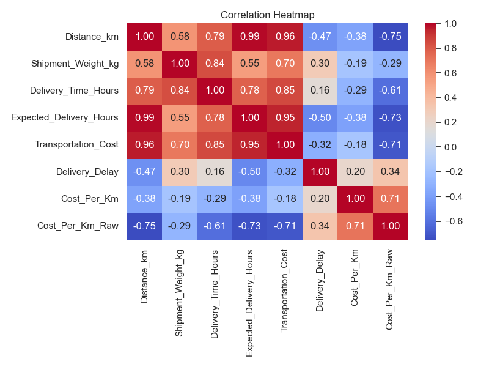
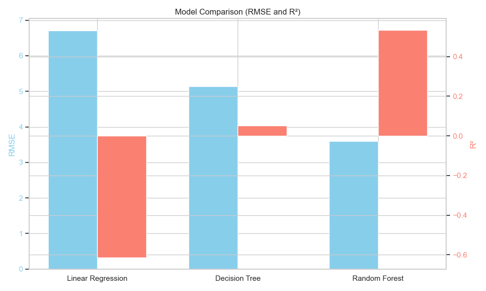
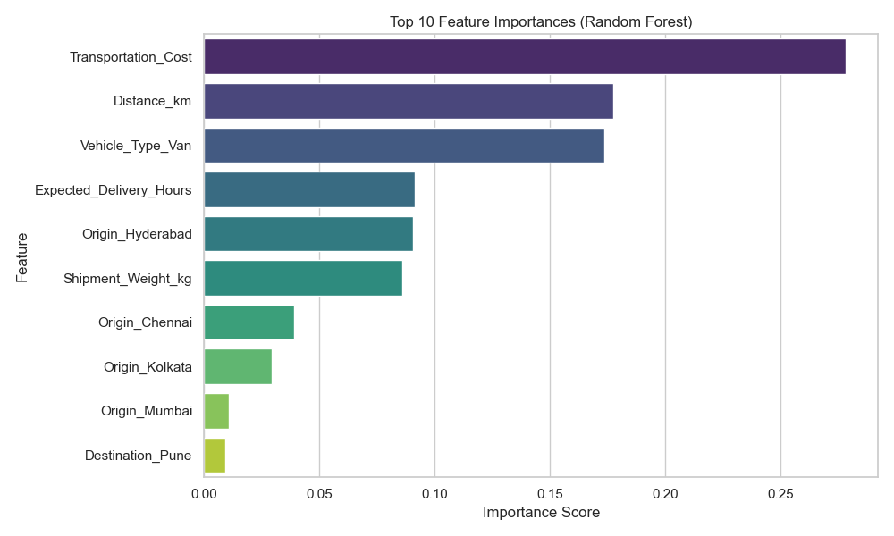

# Logistics Data Analyst Internship — YuvaIntern

**Student Name:** Laxmi Ananda Sanas  
**Internship Role:** Logistics Data Analyst Intern  
**Organization:** YuvaIntern  
**Project Duration:** 4 Weeks  
**Project Theme:** “Logistics Delivery Performance and Route Optimization Using Python”  

## Project Overview

This project demonstrates a comprehensive four-week progression in logistics data analytics, showcasing a complete workflow from initial planning to predictive modeling and optimization. It spans through:

- **Week 1 →** Planning and Logistics Research
- **Week 2 →** Data Collection, Cleaning, and Preprocessing
- **Week 3 →** Advanced Data Analysis and Visualization
- **Week 4 →** Predictive Modeling and Optimization

The four weeks form one connected logistics analytics workflow, starting with raw data understanding and ending with actionable machine learning insights to optimize delivery performance, minimize transportation costs, and improve on-time delivery rates.

## Objectives

- Understand logistics performance data
- Prepare and clean logistics data
- Perform exploratory data analysis
- Visualize operational patterns
- Identify logistics performance indicators
- Build predictive models
- Evaluate predictive performance
- Develop optimization strategies
- Generate actionable logistics insights

## Weekly Project Breakdown

| Week | Topic | Main Activities | Deliverables |
| :--- | :--- | :--- | :--- |
| **Week 1** | Planning & Research | Logistics problem identification, KPIs, data requirements, analytical roadmap, Python planning. | Project Plan & Report |
| **Week 2** | Data Preprocessing | Data collection/simulation, profiling, missing-value handling, duplicate checking, outlier detection, normalization/standardization, feature preparation. | Cleaned Dataset, Python Script, Report |
| **Week 3** | Data Analysis & Visualization | EDA, descriptive statistics, KPI analysis, correlations, distributions, visualizations, logistics insights. | Python Script, Jupyter Notebook, Visualizations, Report |
| **Week 4** | Predictive Modeling | Predictive modeling, model training, evaluation using MAE/RMSE/R², validation, feature importance, and optimization strategies. | Python Script, Jupyter Notebook, Model Visualizations, Report |

## Technologies Used

- Python
- Pandas
- NumPy
- Matplotlib
- Seaborn
- Scikit-learn
- Jupyter Notebook
- Microsoft Word / DOCX
- JSON

## Project Structure

```text
logistics-data-analyst-yuvaintern/
├── .gitignore
├── README.md
├── create_report.py
├── week1/
│   ├── Laxmi_Ananda_Sanas_Week_1_Logistics_Data_Analyst_Report.docx
│   ├── Week_1_GitHub_README.txt
│   └── create_report.py
├── week2/
│   ├── Laxmi_Ananda_Sanas_Week_2_Data_Preprocessing_Report.docx
│   ├── README.md
│   ├── cleaned_logistics_data.csv
│   ├── create_report_week2.py
│   ├── logistics_sample_data.csv
│   └── week2_logistics_preprocessing.py
├── week3/
│   ├── README.md
│   ├── cleaned_logistics_data.csv
│   ├── create_report_week3.py
│   ├── figures/
│   ├── report/
│   │   └── Laxmi_Ananda_Sanas_Week_3_Logistics_Analysis_Report.docx
│   ├── stats.json
│   ├── week3_logistics_analysis.ipynb
│   └── week3_logistics_analysis.py
└── week4/
    ├── README.md
    ├── cleaned_logistics_data.csv
    ├── create_report_week4.py
    ├── figures/
    ├── report/
    │   └── Laxmi_Ananda_Sanas_Week_4_Logistics_Modeling_Report.docx
    ├── stats.json
    ├── week4_logistics_modeling.ipynb
    └── week4_logistics_modeling.py
```

- **reports (`.docx`)**: Detailed weekly analytical reports documenting methodologies and findings.
- **Python Scripts (`.py`)**: Executable scripts for data processing, analysis, modeling, and report generation.
- **Jupyter Notebooks (`.ipynb`)**: Interactive notebooks providing step-by-step EDA and modeling walkthroughs.
- **Datasets (`.csv`)**: Raw sample data and the final cleaned dataset used for modeling.
- **figures/**: Auto-generated visualizations from analysis and machine learning phases.
- **stats.json**: Calculated metrics, KPIs, and machine learning evaluation results.

## Week 1 — Planning and Research

The first week focused on defining the project scope and establishing a strategic roadmap. Key activities included logistics problem identification, determining necessary data requirements, and defining critical Key Performance Indicators (KPIs) such as On-Time Delivery Rate and Average Transportation Cost. This planning phase laid the foundation for the data science methodology executed in the subsequent weeks.

## Week 2 — Data Collection and Preprocessing

Week two involved preparing the raw logistics sample data for analysis. The preprocessing workflow included thorough data profiling, handling missing values, checking for duplicates, and correcting data types. We also performed outlier detection, normalization/standardization, and feature preparation. The resulting `cleaned_logistics_data.csv` provides a robust, error-free dataset that supports all subsequent analysis and modeling.

## Week 3 — Data Analysis and Visualization

In the third week, Exploratory Data Analysis (EDA) was conducted to extract operational patterns. Using Pandas, Matplotlib, and Seaborn, various insights were uncovered regarding delivery performance and costs. Key visualizations generated include:
- Delivery time distribution
- Transportation cost distribution
- Vehicle type analysis
- Distance vs delivery time
- Distance vs transportation cost
- Delivery status
- Time trend
- Correlation heatmap

Analysis of KPIs revealed an average delivery time of 7.6 hours and an average transportation cost of ₹5,458, providing a solid baseline for the predictive modeling phase.

## Week 4 — Predictive Modeling and Optimization

The final week focused on predictive modeling to forecast logistics performance, primarily targeting transportation costs and delivery metrics. The dataset was split into training and testing sets, and multiple models were evaluated. Features such as distance, vehicle type, expected delivery hours, origin, and shipment weight were utilized.

Models implemented included Linear Regression, Decision Tree, and Random Forest. Evaluation metrics such as Mean Absolute Error (MAE), Root Mean Squared Error (RMSE), and R-squared (R²) were used to validate the models and determine the best performer. Feature importance was also analyzed to understand the most significant drivers of logistics performance.

### Machine Learning

The machine learning workflow included:
- Data preparation and feature selection
- Train-test split
- Model training (Linear Regression, Decision Tree, Random Forest)
- Prediction and Evaluation
- Validation and Interpretation
- Optimization recommendations based on feature importance

### Key Analysis / Results

The predictive modeling phase yielded the following performance metrics across the evaluated models:

| Model | MAE | RMSE | R² |
| :--- | :--- | :--- | :--- |
| **Linear Regression** | 4.76 | 6.71 | -0.61 |
| **Decision Tree** | 3.29 | 5.14 | 0.05 |
| **Random Forest (Best)** | 2.69 | 2.80 | 0.72 |

*The Random Forest model performed best, successfully capturing the variance in the target metric with an R² of 0.72.*

### Visualizations

The repository contains several programmatic visualizations. A few highlights include:

**Correlation Heatmap**  
Shows the relationships between numerical features, highlighting strong correlations like Distance vs Transportation Cost.  


**Model Comparison**  
Visualizes the performance differences (MAE, RMSE, R²) between the trained predictive models.  


**Feature Importance**  
Illustrates the most critical factors driving the model's predictions, with `Transportation_Cost` and `Distance_km` being the top features.  


## Logistics Optimization

Predictive insights derived from the models can conceptually support several logistics optimization strategies:
- **Resource Allocation:** Optimizing vehicle type selection based on shipment weight and distance.
- **Route Planning & Delivery Scheduling:** Enhancing dispatch times and route selection to reduce expected delivery hours.
- **Shipment Prioritization:** Flagging high-risk shipments that are likely to be delayed.
- **Transportation Cost Management:** Utilizing feature importance insights to identify areas where costs can be minimized.
- **Operational Efficiency:** Streamlining the overall logistics pipeline based on data-driven KPIs.

## How to Run the Project

1. **Install required dependencies:**
   ```bash
   pip install pandas numpy matplotlib seaborn scikit-learn jupyter
   ```

2. **Run the Python scripts sequentially from the project root:**
   ```bash
   python week2/week2_logistics_preprocessing.py
   python week3/week3_logistics_analysis.py
   python week4/week4_logistics_modeling.py
   ```

3. **Explore the Jupyter Notebooks:**
   ```bash
   jupyter notebook
   ```
   *Open `week3/week3_logistics_analysis.ipynb` or `week4/week4_logistics_modeling.ipynb` in the browser.*

## Internship Learning Outcomes

- Data collection, cleaning, and preprocessing
- Exploratory Data Analysis (EDA)
- Data visualization (Matplotlib, Seaborn)
- Statistical analysis and KPI analysis
- Machine learning (Scikit-learn)
- Model evaluation and feature interpretation
- Logistics analytics
- Python programming
- Data-driven decision making

## Limitations

- **Dataset limitations:** The analysis was performed on a relatively small simulated sample dataset.
- **Limited variables:** Real-world logistics variables such as live traffic, weather conditions, and driver behavior were not included.
- **Conceptual Optimization:** The optimization strategies discussed are scenario-based demonstrations and recommendations, rather than live implementations in a production environment.

## Future Scope

- Integration of larger real-world logistics datasets.
- Incorporation of real-time tracking data, traffic, and weather integration.
- Development of advanced forecasting models (e.g., deep learning or time-series forecasting).
- Implementation of real route and fleet optimization algorithms.
- Creation of real-time logistics dashboards.
- Deployment of the predictive model as a web application or API.

## Conclusion

This four-week project successfully demonstrates a complete logistics analytics workflow. By progressing from thorough planning and rigorous data preprocessing to advanced exploratory data analysis and predictive modeling, it showcases how raw logistics data can be transformed into actionable insights. The implementation of machine learning models to predict performance metrics highlights the powerful role of data science in optimizing logistics operations and driving strategic decision-making.

---

**Author:**  
Laxmi Ananda Sanas  
Logistics Data Analyst Intern  
YuvaIntern
